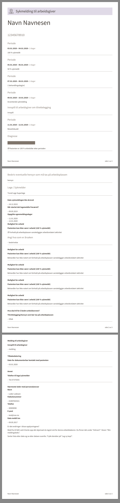

[](https://github.com/navikt/smarbeidsgiverrsx-pdfgen/workflows/Deploy%20to%20dev%20and%20prod/badge.svg)
# smarbeidsgiver-pdfgenrs
Team Sykmelding sin its PDF generator for the employer's version of the sick leave

## Technologies & Tools

* [pdfgenrs](https://github.com/navikt/pdfgenrs)
* Docker
* [Typst](https://typst.app/)

#### Creating a docker image
Creating a docker image should be as simple as 
```bash
docker build -t smarbeidsgiver-pdfgenrs .
```

## Getting started
### Run in development mode
To run the application with templates, data and fonts locally mounted you can use the convenience script
```bash
./run_development.sh
```

When running the application you can test GET requests at
`/api/v1/genpdf/<application>/<template>` which looks for test data at `data/<application>/<template>.json` and outputs
a PDF to your browser.

The template and data directory structure both follow the `<application>/<template>` structure.
Example url: `http://0.0.0.0:8080/api/v1/genpdf/smarbeidsgiver/smarbeidsgiver`

### Example pdf output



### Contact

This project is maintained by [navikt/teamsykmelding](CODEOWNERS)

Questions and/or feature requests? Please create an [issue](https://github.com/navikt/smarbeidsgiver-pdfgents/issues)

If you work in [@navikt](https://github.com/navikt) you can reach us at the Slack
channel [#team-sykmelding](https://nav-it.slack.com/archives/CMA3XV997)

